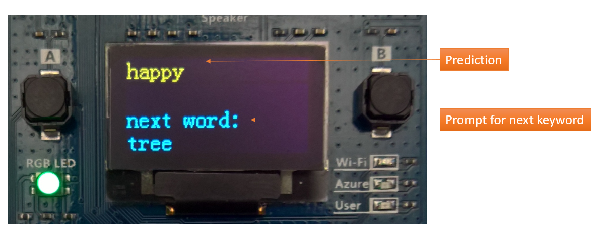

# Keyword Spotting on IoT DevKit with ELL

In this tutorial, you learn how to do some simple voice recognition locally on your IoT DevKit without using a cloud service.
It records your voice, detects what you said from a fixed list of 30 keywords, and shows the result on the DevKit screen.

You can watch the following video to have a deep understanding of what it does.

[](https://aka.ms/iotshow/110)

## About IoT DevKit

The [MXChip IoT DevKit](https://aka.ms/iot-devkit) (a.k.a. IoT DevKit) is an all-in-one Arduino compatible board with rich peripherals and sensors. You can develop for it using [Azure IoT Device Workbench ](https://aka.ms/azure-iot-workbench). And it comes with a growing [projects catalog](https://aka.ms/devkit/project-catalog) to guide you prototype Internet of Things (IoT) solutions that take advantage of Microsoft Azure services.

## What you need

Finish the [Getting Started Guide](./devkit-get-started.md) to:

* Prepare your development environment.

## Open the project folder

### Start VS Code

* Start Visual Studio Code.
* Make sure [Azure IoT Device Workbench](https://marketplace.visualstudio.com/items?itemName=vsciot-vscode.vscode-iot-workbench) is installed.
* Connect IoT DevKit to your PC.

### Open Azure IoT Device Workbench Examples

Use `F1` or `Ctrl+Shift+P` (macOS: `Cmd+Shift+P`) to open the command palette, type **Azure IoT Device Workbench**, and then select **Open Examples...**.


Select **IoT DevKit**.


Then the **IoT Device Workbench Example** window is shown up.


Find **Keyword Spotting on IoT DevKit** and click **Open Sample** button. A new VS Code window with a project folder in it opens.


## Build and upload the device code

1. In VS Code, select the serial port IoT DevKit connect.

1. Open the command palette and select **Azure IoT Device Workbench: Upload Device Code**.

	

1. VS Code then starts verifying and uploading the code to your DevKit.

	

1. The IoT DevKit reboots and starts running the code.

**Note:** Next time you want to load the project just run:
```
code project.code-workspace
```

## Test the project

After app initialization, your DevKit will immediately start listening for spoken keywords.  So try saying any of the following 30 keywords:

    bed, bird, cat, dog, down, eight, five, four, go, happy, house, left, marvin, nine, no, off, on, one, right, seven, sheila, six, stop, three, tree, two, up, wow, yes, zero

The following shows the DevKit has recognized the spoken keyword "happy", shown in yellow.
The screen will also show a prompt for other keywords you can try, shown in blue.



Now, depending on the noise of your location you may need to increase or decrease the microphone gain on the DevKit. You can do this using the following buttons:

1. Press button **A** to decrease the microphone gain.
2. Press button **B** to increase the microphone gain up to a maximum level of 7.

You will see the current gain level printed on the screen like this:


## How it works

Included with the app are the two assembler code files which were compiled and optimized specifically for the ARM Cortex-M4f chip using the [Microsoft ELL Compiler](https://microsoft.github.io/ELL/).
The first is `featurizer.S` which provides an MFCC transform and the second is `classifier.S` which provides a 2-Layer GRU neural network keyword spotter.  More information on how this model works is provided in the [Getting started with audio keyword spotting](https://microsoft.github.io/ELL/tutorials/Getting-started-with-audio-keyword-spotting-on-the-Raspberry-Pi/) tutorial.

This assmbler code provides functions you can call and those functions are defined by the following headers which need to included like this:
```cpp
#define MFCC_WRAPPER_DEFINED
#include "featurizer.h"
#define MODEL_WRAPPER_DEFINED
#include "classifier.h"
```
The #defines turn off the C++ wrappers which don't compile on the Arduino build system, the app uses the lower level "C" api only.

Next you see a set of constants that must match the ELL model being used:
```cpp
// These numbers need to match the compiled ELL models.
const int SAMPLE_RATE = 16000;
const int SAMPLE_BIT_DEPTH = 16;
const int FEATURIZER_INPUT_SIZE = 512;
const int FRAME_RATE = 33; // assumes a "shift" of 512 and 512/16000 = 0.032ms per frame.
const int FEATURIZER_OUTPUT_SIZE = 80;
const int CLASSIFIER_OUTPUT_SIZE = 31;
const float THRESHOLD = 0.9; // accuracy threshold for printed predictions
```
Next you also see some global buffers which will hold the raw incoming audio, the featurized audio, and the classified audio:
```cpp
static int scaled_input_buffer_pos = 0;
static float scaled_input_buffer[FEATURIZER_INPUT_SIZE]; // raw audio converted to float

const int MAX_FEATURE_BUFFERS = 10; // set to buffer up to 1 second of audio in circular buffer
static float featurizer_input_buffers[MAX_FEATURE_BUFFERS][FEATURIZER_INPUT_SIZE]; // input to featurizer
static int featurizer_input_buffer_read = -1; // next read pos
static int featurizer_input_buffer_write = 0; // next write pos
static int dropped_frames = 0;
static float featurizer_output_buffer[FEATURIZER_OUTPUT_SIZE]; // 40 channels
static float classifier_output_buffer[CLASSIFIER_OUTPUT_SIZE]; // 31 classes

static int raw_audio_count = 0;
static char raw_audio_buffer[AUDIO_CHUNK_SIZE];
static int prediction_count = 0;
static int last_prediction = 0;
static int last_confidence = 0; // as a percentage between 0 and 100.
```
You see there is a ring of 10 buffers (see `MAX_FEATURE_BUFFERS`) allocated here which allows the system to adapt to any unusual load without dropping audio frames.  It is very important for the audio classifier to not miss any input audio frames.  The sample app will actually print warning messages if this happens, which you can see if you open the Serial Monitor.

In order to read some audio from the microphone the app uses the following AudioClassV2 library provided with the az3166 SDK as follows:
```cpp
  #include "AudioClassV2.h"

  // Re-config the audio data format
  Audio.format(SAMPLE_RATE, SAMPLE_BIT_DEPTH);
  delay(100);

  Serial.println("listening...");

  // Start to record audio data
  Audio.startRecord(audio_callback);
```
The audio callback does not do the model processing, it only stores the raw audio in the next available ring buffer.  It also checks if it is out of available buffers, in which case a frame is dropped.  You can also see that the code below is skipping the right channel; it turns out on the az3166 sdk the right channel contains no new information anyway, and this gives us twice the amount of time to do the audio processing (64 ms instead of 32 ms).  This code is also scaling the input to floating point values (-1 to 1) which is what the ELL featurizer expects.
```cpp
void audio_callback()
{
  // this is called when Audio class has a buffer full of audio,
  // the buffer is size AUDIO_CHUNK_SIZE (512)
  Audio.readFromRecordBuffer(raw_audio_buffer, AUDIO_CHUNK_SIZE);
  raw_audio_count++;

  char* curReader = &raw_audio_buffer[0];
  char* endReader = &raw_audio_buffer[AUDIO_CHUNK_SIZE];
  while(curReader < endReader)
  {
    if (SAMPLE_BIT_DEPTH == 16)
    {
      // We are getting 512 samples, but with dual channel 16 bit audio this means we are
      // getting 512/4=128 readings after converting to mono channel floating point values.
      // Our featurizer expects 512 readings, so it will take 4 callbacks to fill the featurizer
      // input buffer.
      int bytesPerSample = 2;

      // convert to mono
      int16_t sample = *((int16_t *)curReader);
      curReader += bytesPerSample * 2; // skip right channel

      scaled_input_buffer[scaled_input_buffer_pos] = (float)sample / 32768.0f;
      scaled_input_buffer_pos++;

      if (scaled_input_buffer_pos == FEATURIZER_INPUT_SIZE)
      {
        scaled_input_buffer_pos = 0;
        if (next(featurizer_input_buffer_write) == featurizer_input_buffer_read)
        {
          // dropping frame on the floor since classifier is still processing
          // this buffer, so record this fact so main loop can print a message.
          dropped_frames++;
        }
        else
        {
          memcpy(featurizer_input_buffers[featurizer_input_buffer_write], scaled_input_buffer, FEATURIZER_INPUT_SIZE * sizeof(float));
          featurizer_input_buffer_write = next(featurizer_input_buffer_write);
        }
      }
    }
  }
}
```
So in the main loop of the application the following function is called to process any incoming audio that is available.  First the featurizer with "mfcc_Filter" and then the classifier using "model_Predict".  This algorithm is using some globals `last_prediction` and `last_confidence` to perform a type of "smoothing" over the predictions which avoids too many random fluctuations.

```cpp
bool get_prediction(float* featurizer_input_buffer)
{
  // looks like <chrono> doesn't work, rats...
  SimpleTimer timer;
  timer.start();

  // mfcc transform
  mfcc_Filter(nullptr, featurizer_input_buffer, featurizer_output_buffer);

  // classifier
  model_Predict(nullptr, featurizer_output_buffer, classifier_output_buffer);

  // calculate a cheap version of energy level by summing the mfcc output
  float level = 0;
  for (int i = 0; i < FEATURIZER_OUTPUT_SIZE; i++)
  {
    float x = featurizer_output_buffer[i];
    level += (x*x);
  }

  int vad = vad_signal;
  show_signals(vad, level);

  float max = -1;
  int argmax = 0;

  // argmax over predictions.
  for (int j = 0; j < CLASSIFIER_OUTPUT_SIZE; j++)
  {
      float v = classifier_output_buffer[j];
      if (v > max) {
        max = v;
        argmax = j;
      }
  }

  timer.stop();
  float elapsed = timer.milliseconds();
  int percent = (int)(max * 100);
  bool got_prediction = false;
  if (argmax != 0 && max > THRESHOLD)
  {
    if (last_prediction != argmax)
    {
      last_confidence = 0;
    }
    if (last_prediction != argmax || percent > last_confidence) {

      if (percent > last_confidence)
      {
        if (last_prediction != argmax && vad && argmax < max_category) {
          Serial.printf("Prediction %d is %s (%.2f) on level %.2f, vad=%d, in %d ms\r\n", prediction_count++, categories[argmax], (float)percent/100, level, vad, (int)elapsed);
          Screen.clean();
          Screen.print(0, categories[argmax]);
          if (argmax == hint_index)
          {
            hint_index++;
            if (hint_index == max_category)
            {
              hint_index = 1;
            }
          }
          Screen.print(2, "next word:");
          Screen.print(3, categories[hint_index]);
          got_prediction = true;
        }

        last_prediction = argmax;
        last_confidence = percent;
      }
    }
    if (last_confidence > 0)
    {
      // to smooth the predictions a bit, it doesn't make sense to get two
      // different predictions 30ms apart, so this little count down on the
      // previous confidence level provides this smoothing effect.
      last_confidence -= 1;
    }
  }
  return got_prediction;
}
```

So that's it!  The app then adds some bells and whistles, but the core audio processing loop is pretty simple.  If you open the ">arduino: Open Serial Monitor" you will also see information about "VAD Signal" which is detecting voice activity (actually any audio activity really) and on each prediction you will see a time in milliseconds.  You should see about 21 milliseconds.  This is fast enough to keep up with real time audio input without dropping frames.

Note: the Arduino runtime is expensive.  If you port this app to run using [mbed os](https://github.com/Azure/azure-iot-device-ecosystem/blob/master/get_started/mbed-az3166-c.md)  instead, you will see about a 50% speed up so the time drops to about 12ms.  So if you have performance critical models, then mbed is recommended.

## Try other models

The model used in the above sample app was training using the tutorial [Training audio keyword spotter with pytorch](https://microsoft.github.io/ELL/tutorials/Training-audio-keyword-spotter-with-pytorch/).  You can also use one of the pre-trained models already published to the [Speech Commands Model Gallery](https://microsoft.github.io/ELL/gallery/speech_commands_v0.01/).  The featurizer.S and classifier.S were compiled from the [GRU 110 Roselle](https://github.com/Microsoft/ELL-models/tree/master/models/speech_commands_v0.01/Roselle) model.

**Note:** because these models were only trained on the [speech commands dataset](http://download.tensorflow.org/data/speech_commands_v0.01.tar.gz) and nothing else, they cannot deal with words outside the list of 30 keywords.  So you may see a lot of false positives if you record gibberish.
Eliminating false positives requires training on a much larger dataset.

## Compiling a model for MXCHIP

If you want to use a different model you will also need to compile it using ELL. You will find the ELL compiler in the build\bin folder, on windows it is in build\bin\release\.  Create an environment variable called ELL_BUILD pointing to this location.  Now, because of limitations in how the Arduino-build process works, you need to generate Assembler code rather than the default object code that the ELL compiler normally generates.  So this involves a few more steps than normal.  To produce Assembler code you have to drop down to even lower level tools using the LLVM optimizer (opt) and compiler (llc).  On Linux these tools come with the apt package "llvm".  On Windows you will find them in the ELL external folder under `external\LLVMNativeWindowsLibs.x64.6.0.1\llvm-6.0\bin`.  So if you define a environment variable LLVM_TOOLS pointing to the location of opt and llc then you will be ready to do the following to compile the featurizer and classifier:
```
%ELL_BUILD%\compile -imap featurizer.ell -cfn Filter -cmn mfcc --bitcode -od . --fuseLinearOps True --header --blas false --optimize true --target custom --numBits 32 --cpu cortex-m4 --triple armv6m-gnueabi --features +vfp4,+d16,+soft-float

%ELL_BUILD%\compile -imap classifier.ell -cfn Predict -cmn model --bitcode -od . --fuseLinearOps True --header --blas false --optimize true --target custom --numBits 32 --cpu cortex-m4 --triple armv6m-gnueabi --features +vfp4,+d16,+soft-float
```
You should now have a featurizer.bc, and classifier.bc file which is the ARM Cortex-M4 bitcode.  Bitcode is an LLVM compiler binary intermediate representation.  Next step is to optimize this bitcode using the LLVM opt tool:
```
%LLVM_TOOLS%\opt.exe featurizer.bc -o featurizer.opt.bc -O3
%LLVM_TOOLS%\opt.exe classifier.bc -o classifier.opt.bc -O3
```
And last step is to turn this into ARM Cortex-M4 assembler code using the llc compiler:
```
%LLVM_TOOLS%\\llc.exe featurizer.opt.bc -o featurizer.S -O3 -filetype=asm -mtriple=armv6m-gnueabi -mcpu=cortex-m4 -relocation-model=pic -float-abi=soft -mattr=+vfp4,+d16

%LLVM_TOOLS%\\llc.exe classifier.opt.bc -o classifier.S -O3 -filetype=asm -mtriple=armv6m-gnueabi -mcpu=cortex-m4 -relocation-model=pic -float-abi=soft -mattr=+vfp4,+d16
```
So how you should have the following files which you can include in your MXCHIP Azure IOT Workbench project:
```
featurizer.h
featurizer.S
classifier.h
classifier.S
```
The Arduino build system will automatically include the .S source code and compile it for you and the header files define the API you can call from "C".  Remember to include these files in your app code using the following:
```cpp
#define MFCC_WRAPPER_DEFINED
#include "featurizer.h"
#define MODEL_WRAPPER_DEFINED
#include "classifier.h"
```
The #defines turn off the C++ ModelWrapper because those use STL functions that may not be easy to compile for MXCHIP boards.
