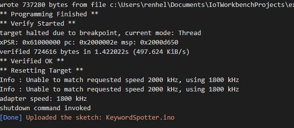
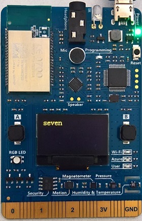
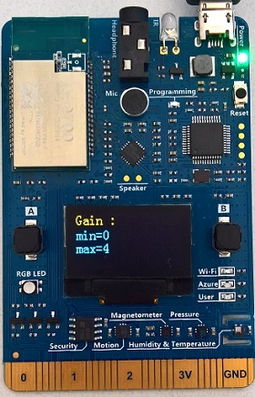

# Keyword Spotting on IoT DevKit with ELL

In this tutorial, you learn how to do some simple voice recognition locally on your IoT DevKit without using a cloud service.
It records your voice, detects what you said from a fixed list of 30 keywords, and shows the result on the DevKit screen.

You can watch the following video to have a deep understanding of what it does.

## About IoT DevKit

The [MXChip IoT DevKit](https://aka.ms/iot-devkit) (a.k.a. IoT DevKit) is an all-in-one Arduino compatible board with rich peripherals and sensors. You can develop for it using [Azure IoT Device Workbench ](https://aka.ms/azure-iot-workbench). And it comes with a growing [projects catalog](https://aka.ms/devkit/project-catalog) to guide you prototype Internet of Things (IoT) solutions that take advantage of Microsoft Azure services.

## What you need

Finish the [Getting Started Guide](./devkit-get-started.md) to:

* Prepare your development environment.

## Open the project folder

### Start VS Code

* Start Visual Studio Code.
* Make sure [Azure IoT Device Workbench](https://marketplace.visualstudio.com/items?itemName=vsciot-vscode.vscode-iot-workbench) is installed.
* Connect IoT DevKit to your PC.

## Build and upload the device code

1. In VS Code, select the serial port IoT DevKit connect.

1. Open the command palette and select **Azure IoT Device Workbench: Upload Device Code**.

	

1. VS Code then starts verifying and uploading the code to your DevKit.

	

1. The IoT DevKit reboots and starts running the code.

## Test the project

After app initialization, your DevKit will immediately start listening for spoken keywords.  So try saying any of the following 30 keywords:

    bed, bird, cat, dog, down, eight, five, four, go, happy, house, left, marvin, nine, no, off, on, one, right, seven, sheila, six, stop, three, tree, two, up, wow, yes, zero

The following shows the DevKit has recognized the spoken keyword "seven":

Now, depending on the noise of your location you may need to increase or decrease the microphone gain on the DevKit. You can do this using the following buttons:

1. Press button **A** to decrease the microphone gain.
2. Press button **B** to increase the microphone gain up to a maximum level of 7.

You will see the current gain level printed on the screen like this:

## Try other models

The neural network included in the classifier source code was compiled to run on the ARM Cortex-M4 chip using the [Microsoft ELL Compiler](https://microsoft.github.io/ELL/).  You can train different keywords using PyTorch
and compile them using ELL by following this [Audio Training tutorial](https://microsoft.github.io/ELL/tutorials/Getting-started-with-audio-keyword-spotting-on-the-Raspberry-Pi/).

